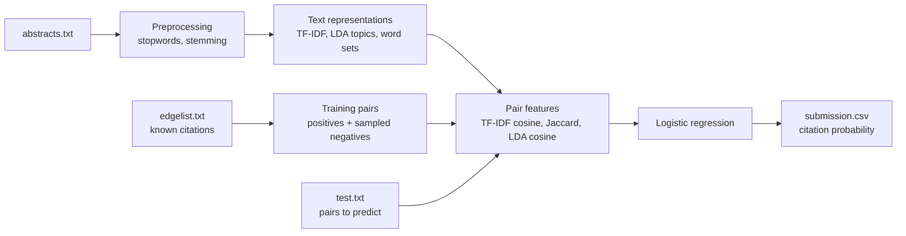

# Citation Link Prediction

Predicts whether one scientific paper cites another, using only the text of their abstracts. Built in Python with scikit-learn, NLTK and gensim: each pair of papers is described by text-similarity features (TF-IDF, Jaccard, LDA topics), and a logistic regression model gives the probability of a citation.


**Result:** combining TF-IDF, Jaccard and LDA-topic similarity brought the validation log loss down to **0.318**, from **0.418** with TF-IDF cosine similarity alone. [All results](#results).

## About

- **Context:** Natural Language Processing course, Department of Computer Science & Engineering, University of Ioannina, 2025. Solved as an in-class Kaggle competition.
- **Team:** Team project (2 students)
- **Status:** Complete as a course project. See [Limitations](#limitations-and-next-steps).

The task: given a citation graph of about 138,000 papers, their abstracts and their authors, predict for 106,692 unseen pairs of papers whether a citation link exists between them. The model outputs a probability for each pair, not just yes or no, and we measured its quality with log loss, which rewards well-calibrated probabilities.

We treat it as binary classification over pairs of papers. Known citations are the positive examples; random pairs that are not citations are the negative examples. For each pair we compute how similar the two abstracts are, in several ways, and train a classifier on those similarity scores.

## Features

- Text preprocessing: lowercasing, removal of non-letters and English stopwords, Porter stemming (NLTK)
- Negative sampling: as many random non-citing pairs as there are citations, checked against the known edges in both directions
- Text representations compared: TF-IDF, doc2vec, Sentence-BERT (`all-MiniLM-L6-v2`), LDA topic distributions
- Pair features: TF-IDF cosine similarity, Jaccard similarity of word sets, cosine similarity of LDA topic vectors
- Logistic regression classifier, evaluated by log loss on a 20% hold-out set; writes a Kaggle submission file

## Tech stack

- **Language:** Python 3
- **Libraries:** pandas, NumPy, scikit-learn, NLTK, gensim, sentence-transformers
- **Tools:** Jupyter

## How it works



The final pipeline is [notebooks/04_final_tfidf_jaccard_lda.ipynb](notebooks/04_final_tfidf_jaccard_lda.ipynb):

1. **Preprocessing:** each abstract is lowercased, stripped of non-letters and stopwords, and stemmed with the Porter stemmer.
2. **Representations:** TF-IDF vectors (4,000 terms, sublinear term frequency), LDA topic distributions (25 topics over a 2,000-term vocabulary) and the set of stemmed words of each abstract.
3. **Training pairs:** all 1,091,955 known citations are labelled 1. The same number of random pairs is labelled 0, rejecting self-pairs and any pair that is a known citation in either direction.
4. **Pair features:** for each pair, three numbers: TF-IDF cosine similarity, Jaccard similarity of the word sets, and cosine similarity of the topic distributions.
5. **Model:** logistic regression on the three features, trained on 80% of the pairs and evaluated on the other 20% by log loss. It then predicts a probability for each test pair.

### Design decisions

- **Pair similarity scores instead of full document vectors:** each pair is reduced to a few numbers, so training on more than two million pairs is fast and the model has little room to overfit. Trade-off: the model sees only how similar two papers are, not what they are about.
- **Three similarity measures that capture different things:** TF-IDF cosine weights shared words by how rare and how frequent they are; Jaccard counts only whether words are shared, whatever their frequency; LDA topics can match papers on the same subject that use different words. Adding Jaccard and LDA to TF-IDF gave the biggest single improvement of the project.
- **Logistic regression:** its outputs are probabilities, which is what log loss scores, and it is quick to retrain during experiments. Trade-off: a linear model can't capture interactions between the features that a tree-based model could.
- **Random negative sampling with a forbidden set:** negatives are cheap to generate and can never be real citations. Trade-off: random pairs of papers are usually very different, so they may be easier to tell apart than the negatives in the test set, and the validation score may be optimistic.

## Getting started

### Prerequisites

- Python 3 and Jupyter
- The competition data (not included, see [Dataset](#dataset))
- Enough memory: notebooks 01 and 04 turn the TF-IDF matrix into a dense array (138,499 × 4,000 values, about 4.4 GB), so 16 GB of RAM is recommended

### Installation

```bash
git clone https://github.com/KonstantinosChatzopoulos/citation-link-prediction.git
cd citation-link-prediction
pip install -r requirements.txt
python -m nltk.downloader stopwords
```

### Run

1. Put `abstracts.txt`, `authors.txt`, `edgelist.txt` and `test.txt` in the `notebooks/` folder. The notebooks read them from their own folder.
2. Start Jupyter and run a notebook from top to bottom:

```bash
jupyter notebook notebooks/04_final_tfidf_jaccard_lda.ipynb
```

Each notebook prints its validation log loss and writes `submission.csv` in `notebooks/`. The Sentence-BERT notebook downloads its model on first run and took about an hour per run on our machines.

## Dataset

The data was provided through the course's in-class Kaggle competition and is not redistributed here.

| File | Contents |
|---|---|
| `abstracts.txt` | 138,499 lines, `paper_id\|--\|abstract` (136 MB) |
| `authors.txt` | `paper_id\|--\|author 1,author 2,...` |
| `edgelist.txt` | 1,091,955 known citations, `source,target` |
| `test.txt` | 106,692 pairs to predict, `source,target` |

The submission has one row per test pair: `ID,Label`, where `Label` is the predicted probability of a citation.

## Notebooks

| Notebook | Representation | Pair features | Negatives |
|---|---|---|---|
| [01_tfidf_baseline](notebooks/01_tfidf_baseline.ipynb) | TF-IDF, 4,000 terms, sublinear TF | Cosine | Rejection sampling |
| [02_doc2vec](notebooks/02_doc2vec.ipynb) | doc2vec, 128 dimensions, window 5 | Cosine | Shuffled targets |
| [03_sentence_bert](notebooks/03_sentence_bert.ipynb) | Sentence-BERT `all-MiniLM-L6-v2` | Cosine | Rejection sampling |
| [04_final_tfidf_jaccard_lda](notebooks/04_final_tfidf_jaccard_lda.ipynb) | TF-IDF + LDA (25 topics) + word sets | Cosine, Jaccard, LDA cosine | Rejection sampling |

All four use logistic regression and the same 80/20 split.

## Results

Validation log loss on the 20% hold-out set (lower is better). The first column is from the experiments recorded in our course report. The second is the output saved in each notebook as submitted, where it exists; some settings differ from the report's runs, as noted.

| Approach | Log loss (report) | Saved notebook output |
|---|---|---|
| TF-IDF cosine | 0.4182 (4,000 terms) | 0.3677 (4,000 terms, sublinear TF) |
| doc2vec cosine | 0.4059 (tuned settings, below) | 0.5534 (first settings: 128 dimensions, window 5) |
| Sentence-BERT cosine | 0.4893 | 0.4893 |
| **TF-IDF + Jaccard + LDA** | **0.3184** (20 topics); 0.3240 (25 topics, as in notebook 04) | not saved |

<details>
<summary>Hyperparameter experiments from the report</summary>

**TF-IDF vocabulary size** (cosine similarity only):

| Terms | 500 | 3,000 | **4,000** | 5,000 | 6,000 |
|---|---|---|---|---|---|
| Log loss | 0.45 | 0.4189 | **0.4182** | 0.4193 | 0.4214 |

Sublinear term frequency (`sublinear_tf=True`) gave a further small improvement.

**doc2vec**, tuned one parameter at a time:

| Step | Values tried → log loss | Kept |
|---|---|---|
| Vector size (window 5) | 40 → 0.4975, 42 → 0.4982, 43 → 0.4968, 45 → 0.4984 | 45 |
| Window (vector 45) | 1 → 0.4544, 2 → 0.4531, 3 → 0.4598, 4 → 0.47, 5 → 0.49 | 2 |
| Min count | 1 → 0.4532, 2 → 0.4531, 3 → 0.4525, 4 → 0.4529 | 3 |
| Architecture (`dm`) | 0 (DBOW) → 0.4984, 1 (DM) → 0.4497 | 1 |
| Epochs | 5 → 0.4681, 10 → 0.4059, 15 → 0.4543, 20 → 0.4609 | 10 |

**LDA topics** (with TF-IDF and Jaccard):

| LDA vocabulary / topics | 2,000 / 20 | 4,000 / 20 | 2,000 / 15 | 2,000 / 25 |
|---|---|---|---|---|
| Log loss | **0.3184** | 0.3194 | 0.3212 | 0.3240 |

</details>

## Project structure

```text
citation-link-prediction/
├── notebooks/
│   ├── 01_tfidf_baseline.ipynb            # TF-IDF cosine similarity
│   ├── 02_doc2vec.ipynb                   # doc2vec cosine similarity
│   ├── 03_sentence_bert.ipynb             # Sentence-BERT cosine similarity
│   └── 04_final_tfidf_jaccard_lda.ipynb   # final pipeline: three similarity features
├── requirements.txt
├── LICENSE
└── README.md
```

## What I learned

- Framing link prediction as binary classification, and building negative examples that can't be real links
- How sparse (TF-IDF) and dense (doc2vec, Sentence-BERT) text representations compare on the same task
- Tuning hyperparameters one at a time against a probabilistic metric (log loss)
- Combining similarity measures that capture different kinds of overlap gains more than tuning any single one

## Limitations and next steps

- **Text only:** the citation graph is used only for labels. Graph features such as common neighbours or Adamic-Adar were not tried.
- **One classifier:** only logistic regression was used; tree-based models (random forest, gradient boosting) were not compared.
- **Authors unused:** a first attempt to use author names as features made the log loss much worse (from about 0.4 to about 0.8), so it was dropped.
- **Memory:** notebooks 01 and 04 turn the TF-IDF matrix into a dense array, and a first Word2Vec approach didn't fit in memory.
- **Reproducibility:** negative sampling isn't seeded, so results change slightly between runs. The submitted doc2vec notebook has its first settings, not the tuned ones.
- **Evaluation:** only log loss was measured.

Next steps: graph features and tree-based classifiers; accuracy, precision, F1 and ROC curves; GloVe embeddings; 2-D and 3-D visualisations of the document vectors.

## Acknowledgments

- Built with a teammate as a two-person course project.
- The task and dataset come from the course's Kaggle competition, set by the course instructor. They are not included in this repo.
- AI assistance: this README and the repository layout were prepared with AI assistance. The notebooks are our original work.

## License

Released under the [MIT License](LICENSE).
